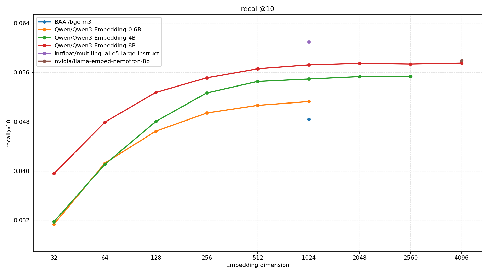
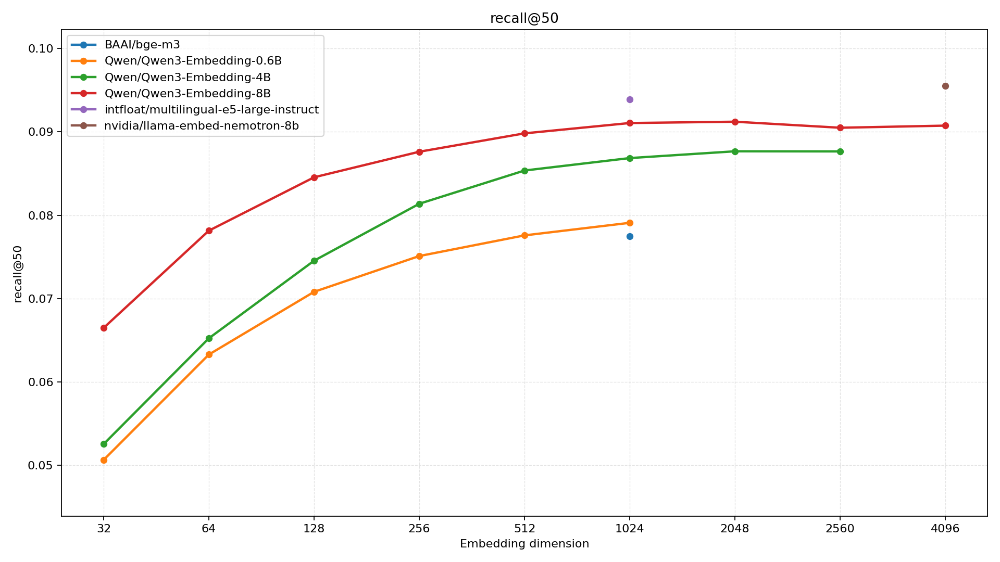
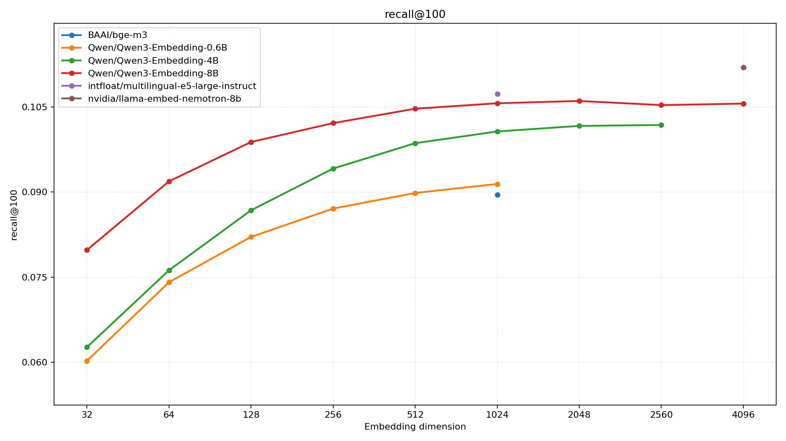
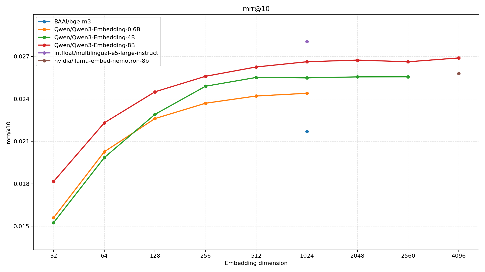
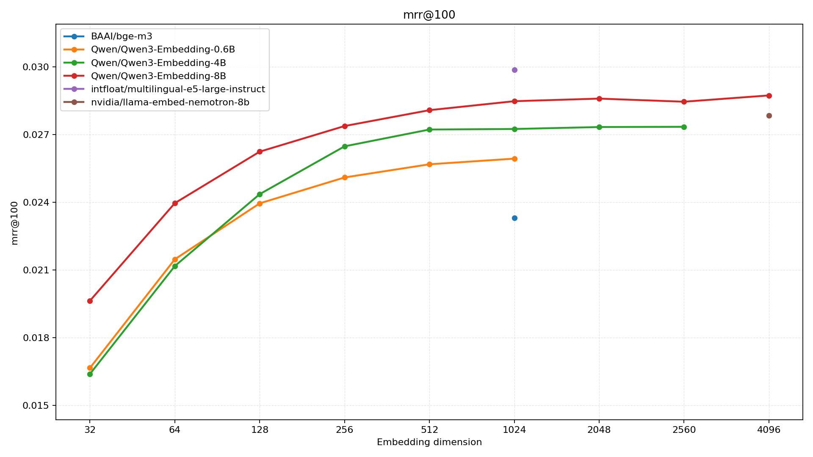
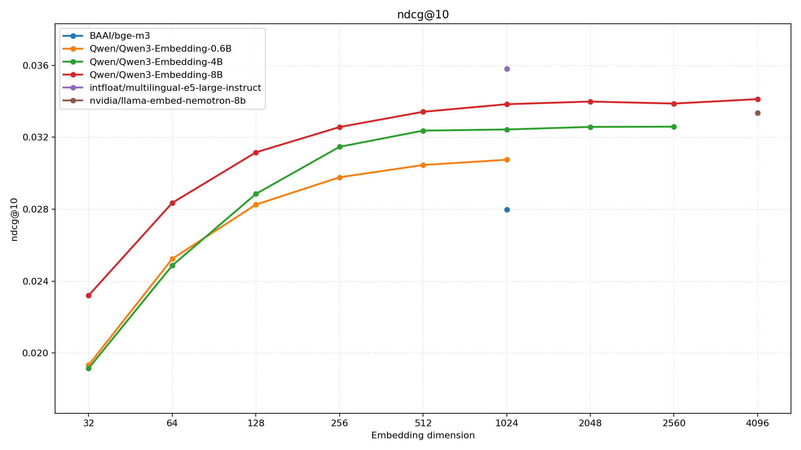
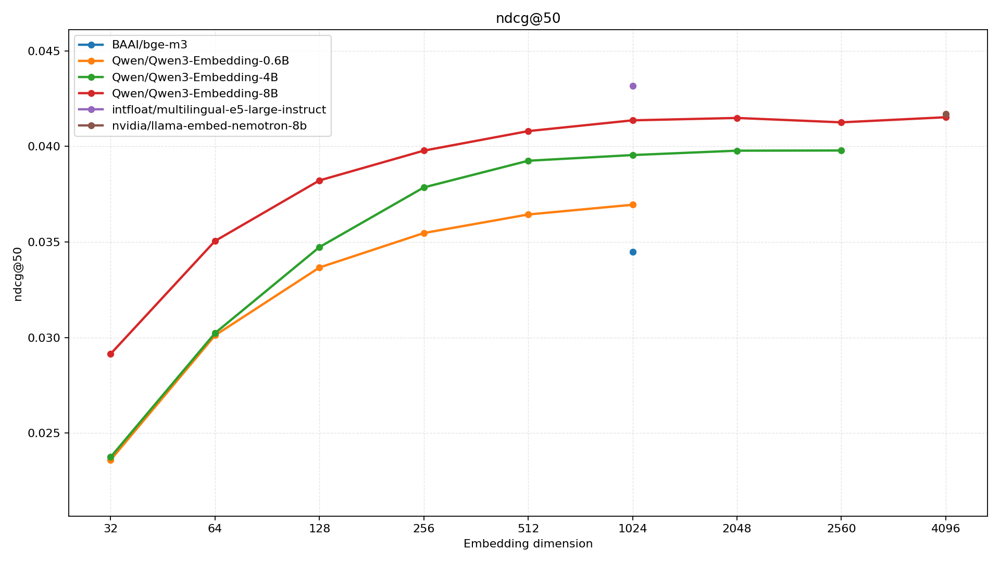
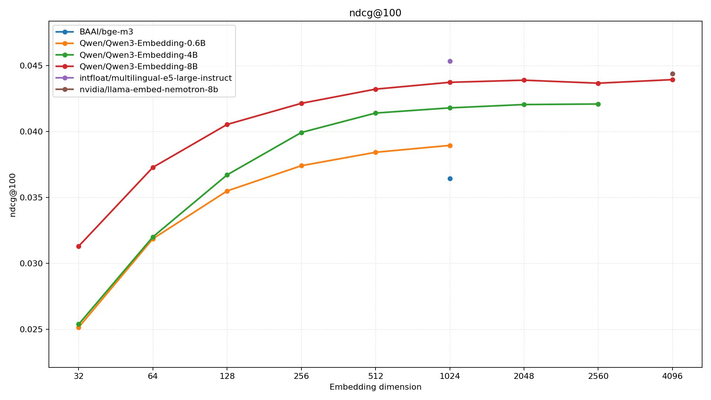
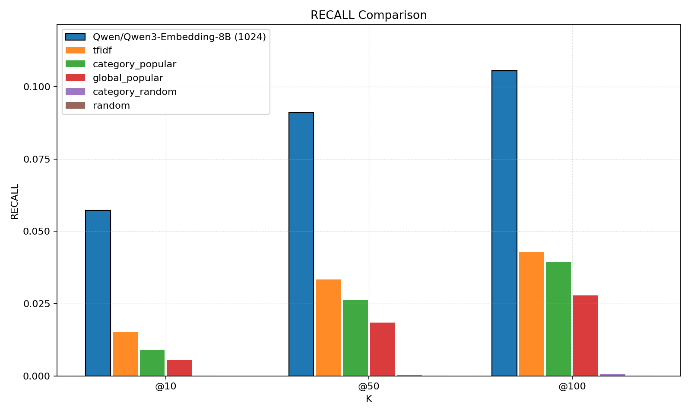

# Semantic Retrieval Benchmark for Book Recommendation

An offline benchmark on Amazon Reviews 2023 (Books) for comparing different open-source embedding models and embedding dimensions in next-item retrieval.

<table>
  <tr>
    <td align="center">
      <h3>Recall@10</h3>
      
    </td>
    <td align="center">
      <h3>Recall@50</h3>
      
    </td>
    <td align="center">
      <h3>Recall@100</h3>
      
    </td>
  </tr>
  <tr>
    <td align="center">
      <h3>MRR@10</h3>
      
    </td>
    <td align="center">
      <h3>MRR@50</h3>
      
    </td>
    <td align="center">
      <h3>MRR@100</h3>
      
    </td>
  </tr>
  <tr>
    <td align="center">
      <h3>NDCG@10</h3>
      
    </td>
    <td align="center">
      <h3>NDCG@50</h3>
      
    </td>
    <td align="center">
      <h3>NDCG@100</h3>
      
    </td>
  </tr>
</table>




## Overview

This repository provides an end-to-end offline workflow:

1. Build cleaned item metadata (`items.jsonl`)
2. Build cleaned interactions (`interactions.jsonl`)
3. Build eval queries (`eval.jsonl`)
4. Generate item embeddings from experiment config
5. Run reusable non-semantic baselines on the same eval set
6. Evaluate embedding retrieval metrics (Recall/NDCG/MRR)
7. Plot model-vs-dimension comparisons from eval results

Primary metrics:

- Recall@10, Recall@50, Recall@100
- NDCG@10, NDCG@50, NDCG@100
- MRR@10, MRR@50, MRR@100

Detailed protocol lives in [`docs/dev_guide.md`](docs/dev_guide.md).

## Models Under Evaluation

Current TAC-style benchmark configs cover:

| Model | Embedding Dimension | MRL Support |
|---|---:|---|
| [BAAI/bge-m3](https://huggingface.co/BAAI/bge-m3) | 1024 | No |
| [intfloat/multilingual-e5-large-instruct](https://huggingface.co/intfloat/multilingual-e5-large-instruct) | 1024 | No |
| [mixedbread-ai/mxbai-embed-large-v1](https://huggingface.co/mixedbread-ai/mxbai-embed-large-v1) | 1024 | Yes |
| [nvidia/llama-embed-nemotron-8b](https://huggingface.co/nvidia/llama-embed-nemotron-8b) | 4096 | No |
| [Qwen/Qwen3-Embedding-0.6B](https://huggingface.co/Qwen/Qwen3-Embedding-0.6B) | 1024 | Yes |
| [Qwen/Qwen3-Embedding-4B](https://huggingface.co/Qwen/Qwen3-Embedding-4B) | 2560 | Yes |
| [Qwen/Qwen3-Embedding-8B](https://huggingface.co/Qwen/Qwen3-Embedding-8B) | 4096 | Yes |

## Repository Layout

```text
configs/
  tac/                        # TAC-style single-view experiments
  other/                      # concat / weighted multi-view experiments
docs/
  dev_guide.md
scripts/
  baselines/
    baseline_utils.py
    retrieve_baselines.py
  data/
    build_items.py
    build_interactions.py
    build_eval.py
    build_items_subset_from_eval.py
  embedding/
    generate_item_embeddings.py
  retrieval/
    ann_utils.py
    review_item_neighbors.py
  eval/
    plot_baseline_vs_embedding.py
    run_eval.py
    plot_eval_results.py
tests/
run.sh
```

## Requirements

- Python 3.10
- `uv`
- Local Hugging Face model cache (embedding is local-only by design)

## Environment Setup

```bash
uv python install 3.10
uv venv --python 3.10
UV_CACHE_DIR=.uv-cache uv sync
```

Run all scripts via `uv`:

```bash
UV_CACHE_DIR=.uv-cache uv run python <script>.py ...
```

## Data

Expected raw files are **uncompressed** JSONL:

- `data/raw/meta_Books.jsonl`
- `data/raw/Books.jsonl`

Download example:

```bash
mkdir -p data/raw
curl -L --fail "https://huggingface.co/datasets/McAuley-Lab/Amazon-Reviews-2023/resolve/main/raw/meta_categories/meta_Books.jsonl" -o data/raw/meta_Books.jsonl
curl -L --fail "https://huggingface.co/datasets/McAuley-Lab/Amazon-Reviews-2023/resolve/main/raw/review_categories/Books.jsonl" -o data/raw/Books.jsonl
```

## Quickstart

### 1) Build items

```bash
UV_CACHE_DIR=.uv-cache uv run python scripts/data/build_items.py \
  --input data/raw/meta_Books.jsonl \
  --output data/processed/items.jsonl
```

### 2) Build interactions

```bash
UV_CACHE_DIR=.uv-cache uv run python scripts/data/build_interactions.py \
  --books-input data/raw/Books.jsonl \
  --items-input data/processed/items.jsonl \
  --output data/processed/interactions.jsonl \
  --seed 42
```

### 3) Build eval set

```bash
UV_CACHE_DIR=.uv-cache uv run python scripts/data/build_eval.py \
  --interactions-input data/processed/interactions.jsonl \
  --queries-output data/processed/eval.jsonl \
  --rating-threshold 4.0 \
  --min-user-pos 1 \
  --min-item-pos 1 \
  --query-history-n 1 \
  --seed 42
```

### 4) (Optional) Build smaller items subset from eval

```bash
UV_CACHE_DIR=.uv-cache uv run python scripts/data/build_items_subset_from_eval.py \
  --eval-input data/processed/eval.jsonl \
  --items-input data/processed/items.jsonl
```

Use subset for faster embedding iteration by passing it to `--items-input` in step 5.

### 5) Run non-semantic baselines

```bash
UV_CACHE_DIR=.uv-cache uv run python scripts/baselines/retrieve_baselines.py \
  --baseline global_popular \
  --items-input data/processed/items.jsonl \
  --interactions-input data/processed/interactions.jsonl \
  --eval-input data/processed/eval.jsonl \
  --output-root outputs/baselines \
  --topk 10,50,100 \
  --seed 42
```

TF-IDF baseline example:

```bash
UV_CACHE_DIR=.uv-cache uv run python scripts/baselines/retrieve_baselines.py \
  --baseline tfidf \
  --items-input data/processed/items.jsonl \
  --interactions-input data/processed/interactions.jsonl \
  --eval-input data/processed/eval.jsonl \
  --output-root outputs/baselines \
  --topk 10,50,100 \
  --workers 8
```

Supported P0 baselines:

- `random`
- `global_popular`
- `category_random`
- `category_popular`
- `tfidf`

All baselines:

- consume the same `items.jsonl`, `interactions.jsonl`, and `eval.jsonl`
- reuse the same `Recall@K` / `MRR@K` / `NDCG@K` definitions as `scripts/eval/run_eval.py`
- exclude `query_item_ids` from candidates
- write outputs to `outputs/baselines/<baseline>/<run_id>/`

### 6) Generate embeddings

```bash
UV_CACHE_DIR=.uv-cache uv run python scripts/embedding/generate_item_embeddings.py \
  --experiment-config configs/tac/exp_bge_tac.yaml \
  --items-input data/processed/items.jsonl \
  --device mps \
  --allow-device-fallback \
  --batch-size 64
```

### 7) Run retrieval evaluation

```bash
UV_CACHE_DIR=.uv-cache uv run python scripts/eval/run_eval.py \
  --eval-input data/processed/eval.jsonl \
  --embedding-dir outputs/embeddings/BAAI__bge-m3/<run_id> \
  --embedding-dim max \
  --output-root outputs/eval \
  --topk 10,50,100 \
  --index-type hnsw
```

### 8) Batch-run eval for all current embeddings

`run.sh` loops over `outputs/embeddings/*/*` and runs `run_eval.py` with:

- `--embedding-dim all`
- `--query-pooling last`
- per-run `eval_run_id`

```bash
./run.sh
```

Useful overrides:

```bash
EVAL_INPUT=data/processed/eval_u6_i5_q5.jsonl \
OUTPUT_ROOT=outputs/eval/last \
./run.sh
```

### 9) Plot eval results

By directory:

```bash
XDG_CACHE_HOME=.cache MPLCONFIGDIR=.cache/matplotlib UV_CACHE_DIR=.uv-cache \
uv run python scripts/eval/plot_eval_results.py \
  --input outputs/eval/last
```

By manifest:

```bash
XDG_CACHE_HOME=.cache MPLCONFIGDIR=.cache/matplotlib UV_CACHE_DIR=.uv-cache \
uv run python scripts/eval/plot_eval_results.py \
  --input outputs/eval/last/<batch_ts>_manifest.txt
```

Default output is `img/`.

### 10) Compare one embedding run against baselines

```bash
XDG_CACHE_HOME=.cache MPLCONFIGDIR=.cache/matplotlib UV_CACHE_DIR=.uv-cache \
uv run python scripts/eval/plot_baseline_vs_embedding.py \
  --embedding-eval-dir outputs/eval/last/20260306143956_Qwen__Qwen3-Embedding-8B_20260305170301054/dim_1024 \
  --baseline-root outputs/baselines
```

Default output is `img/baseline_comparison/`.

## Current Benchmark Snapshot

Current comparison plots are generated from:

- Eval root: `outputs/eval/last`
- Plot dir: `img/`
- Eval set: `data/processed/eval_u6_i5_q5.jsonl`
- Retrieval mode: `pooling`
- Query pooling: `last`
- Index type: `hnsw`

Best current checkpoints from `outputs/eval/last/plots/results.csv`:

| Metric | Best model | Best dim | Score |
|---|---|---:|---:|
| Recall@10 | `intfloat/multilingual-e5-large-instruct` | 1024 | 0.0609 |
| Recall@50 | `nvidia/llama-embed-nemotron-8b` | 4096 | 0.0955 |
| Recall@100 | `nvidia/llama-embed-nemotron-8b` | 4096 | 0.1120 |
| MRR@10 | `intfloat/multilingual-e5-large-instruct` | 1024 | 0.0281 |
| MRR@50 | `intfloat/multilingual-e5-large-instruct` | 1024 | 0.0297 |
| MRR@100 | `intfloat/multilingual-e5-large-instruct` | 1024 | 0.0299 |
| NDCG@10 | `intfloat/multilingual-e5-large-instruct` | 1024 | 0.0358 |
| NDCG@50 | `intfloat/multilingual-e5-large-instruct` | 1024 | 0.0432 |
| NDCG@100 | `intfloat/multilingual-e5-large-instruct` | 1024 | 0.0453 |

Observed conclusions:

- `intfloat/multilingual-e5-large-instruct` is the strongest overall model in the current `last`-pooling benchmark, especially on rank-sensitive metrics (`MRR`, `NDCG`) and `Recall@10`.
- `nvidia/llama-embed-nemotron-8b` reaches the best `Recall@50` and `Recall@100`, suggesting stronger broader-recall behavior at larger cutoffs.
- For the Qwen family, performance improves steadily as dimension increases; `Qwen3-Embedding-8B` at `4096` is clearly stronger than the lower-dim variants.
- `BAAI/bge-m3` is a reasonable baseline, but on the current protocol it trails the stronger multilingual / larger Qwen / Nemotron models.
- Among the current non-semantic baselines, `tfidf` is the strongest overall lexical baseline and outperforms `category_popular` / `global_popular`, while still trailing the stronger embedding models by a wide margin.

Baseline comparison should use the same `eval.jsonl` and the same `topK` list. The simplest workflow is:

1. Run one or more baselines into `outputs/baselines/<baseline>/<run_id>/report.json`.
2. Run embedding eval into `outputs/eval/<eval_run_id>/run_eval_report.json`.
3. Generate grouped bar charts into `img/baseline_comparison/` with `scripts/eval/plot_baseline_vs_embedding.py`.

### Recall@10


### Recall@50


### Recall@100


### MRR@10


### MRR@50


### MRR@100


### NDCG@10


### NDCG@50


### NDCG@100


## Experiment Configs

Config files are under:

- `configs/tac/*.yaml`
- `configs/other/*.yaml`

### Config schema

```yaml
experiment_id: exp_bge_weighted_v1

model:
  name: BAAI/bge-m3
  embedding_dim: [1024]
  max_length: 512
  normalize_embeddings: true
  # trust_remote_code: false

text_views:
  views:
    - view_id: view_title
      fields: [title, subtitle, author]
      template: |
        Title: {title}
        Subtitle: {subtitle}
        Author: {author}

fusion:
  method: weighted_mean   # identity | weighted_mean
  input_views: [view_title]
  weights:
    view_title: 1.0
  normalization: true     # controls post-fusion normalization only
```

### Config field reference

| Field | Type | Required | Description |
|---|---|---|---|
| `experiment_id` | string | yes | Unique experiment identifier, stored in per-run `config.json`. |
| `model.name` | string | yes | Hugging Face repo id (`namespace/model`). |
| `model.embedding_dim` | list[int] | yes | Output dims list (strictly increasing, each value must be <= model output dim). |
| `model.max_length` | int | yes | Token truncation length. |
| `model.normalize_embeddings` | bool | yes | Normalize each model output embedding before fusion. |
| `model.trust_remote_code` | bool | no | Needed for models that require custom code. |
| `text_views.views[].view_id` | string | yes | View identifier. Must be unique. |
| `text_views.views[].fields` | list[string] | yes | Item fields used to fill template. |
| `text_views.views[].template` | string | yes | Render template for the view. |
| `fusion.method` | enum | yes | `identity` or `weighted_mean`. |
| `fusion.input_views` | list[string] | yes | View ids to fuse. Must exist in `text_views.views`. |
| `fusion.weights` | map | conditional | Required when `fusion.method=weighted_mean`. |
| `fusion.normalization` | bool | yes | Whether to normalize after fusion. |

Notes:

- `identity` requires exactly one `fusion.input_views` entry.
- Canonical `fusion.method` values are strictly: `identity`, `weighted_mean`.

## CLI Reference

### `scripts/data/build_items.py`

| Arg | Default | Description |
|---|---|---|
| `--input` | `data/raw/meta_Books.jsonl` | Raw metadata input JSONL. |
| `--output` | `data/processed/items.jsonl` | Cleaned items output JSONL. |
| `--report` | `reports/build_items_report.json` | Build report output path. |
| `--tmp-db` | `data/processed/.tmp_build_items.sqlite3` | Temporary sqlite for dedup / merge logic. |

### `scripts/data/build_interactions.py`

| Arg | Default | Description |
|---|---|---|
| `--books-input` | `data/raw/Books.jsonl` | Raw interactions input JSONL. |
| `--items-input` | `data/processed/items.jsonl` | Filter interactions to valid item ids from this file. |
| `--output` | `data/processed/interactions.jsonl` | Cleaned interactions output JSONL. |
| `--report` | `reports/build_interactions_report.json` | Build report output path. |
| `--seed` | `42` | Protocol metadata seed (reserved for deterministic config tracking). |

### `scripts/data/build_eval.py`

| Arg | Default | Description |
|---|---|---|
| `--interactions-input` | `data/processed/interactions.jsonl` | Input interactions. |
| `--queries-output` | `data/processed/eval.jsonl` | Output eval query set. |
| `--report-output` | auto | Build report output path. If omitted: `reports/build_eval_report_<queries_output_stem>.json`. |
| `--rating-threshold` | `4.0` | Positive sample rule: `rating >= threshold`. |
| `--min-user-pos` | `1` | Minimum positives per user after filtering. |
| `--min-item-pos` | `1` | Minimum positives per item after filtering. |
| `--query-history-n` | `1` | Number of historical positives used as query context. |
| `--seed` | `42` | Protocol metadata seed. |

### `scripts/data/build_items_subset_from_eval.py`

| Arg | Default | Description |
|---|---|---|
| `--eval-input` | `data/processed/eval.jsonl` | Eval set containing query/target ids. |
| `--items-input` | `data/processed/items.jsonl` | Full items file. |
| `--output` | auto | Reduced items file. If omitted: `data/processed/items_subset_<eval_input_stem>.jsonl`. |
| `--report` | auto | Build report output path. If omitted: `reports/build_items_subset_report_from_<eval_input_stem>.json`. |

### `scripts/baselines/retrieve_baselines.py`

| Arg | Default | Description |
|---|---|---|
| `--baseline` | required | `random`, `global_popular`, `category_random`, `category_popular`, or `tfidf`. |
| `--items-input` | `data/processed/items.jsonl` | Item metadata input used for candidate universe and categories. |
| `--interactions-input` | `data/processed/interactions.jsonl` | Interaction input used for popularity counting. |
| `--eval-input` | `data/processed/eval.jsonl` | Eval query set input. |
| `--output-root` | `outputs/baselines` | Output root; writes into `<output_root>/<baseline>/<run_id>/`. |
| `--topk` | `10,50` | Comma-separated K list, for example `10,50,100`. |
| `--max-query` | `0` | `0` = all valid queries; `>0` = first N valid queries. |
| `--seed` | `42` | RNG seed for deterministic random baselines. |
| `--rating-threshold` | `4.0` | Popularity counts only interactions with `rating >= threshold`. |
| `--run-id` | timestamp | Optional run id (`YYYYMMDDHHMMSSmmm` if omitted). |
| `--text-fields` | `title,author,categories` | Comma-separated item fields used by `tfidf`. |
| `--workers` | `1` | Worker processes used when precomputing TF-IDF query pools. |

Behavior:

- `random`: sample uniformly from the full candidate set.
- `global_popular`: rank all items by positive interaction count.
- `category_random`: exact-match category filter first, then random fallback if query categories are missing or empty.
- `category_popular`: exact-match category filter first, then popularity ranking within the matched pool, with global-popular fallback.
- `category_*` uses the last query item's `categories` string, aligned with the current `query-pooling=last` embedding eval protocol.
- Category baselines use short prebuilt candidate pools (default size `128`) and fall back to global pools when the category pool is missing or too short.
- `tfidf`: build a sparse lexical baseline over item text (`title`, `author`, `categories` by default) and rank items by TF-IDF overlap with the last query item.
- `tfidf` uses the same eval protocol and excludes `query_item_ids` from predictions; if a query item has no usable text, it falls back to `global_popular`.
- All baselines exclude `query_item_ids` themselves from predictions.

### `scripts/embedding/generate_item_embeddings.py`

| Arg | Default | Description |
|---|---|---|
| `--experiment-config` | required | Experiment YAML path. |
| `--items-input` | `data/processed/items.jsonl` | Items input used for rendering views. |
| `--output-root` | `outputs/embeddings` | Embedding artifact root. |
| `--device` | `mps` | Requested device (`mps`/`cuda`/`cpu`). |
| `--allow-device-fallback` | false | Fallback to CPU if requested device unavailable. |
| `--seed` | `42` | RNG seed. |
| `--batch-size` | `64` | Encoding batch size. |
| `--save-view-embeddings` | false | Also save per-view embeddings (`item_embeddings__<view>_<dim>.npy`). |
| `--max-items` | none | Debug cap on number of items to encode. |

Important behavior:

- Local-only model loading (`local_files_only=True`); model must already exist in `~/.cache/huggingface/hub`.
- Output path: `outputs/embeddings/<model_dir>/<run_id>/...`
  - `model_dir` is `model.name` with `/` replaced by `__`.
  - `run_id` is local timestamp with milliseconds (`YYYYMMDDHHMMSSmmm`).

### `scripts/eval/run_eval.py`

| Arg | Default | Description |
|---|---|---|
| `--eval-input` | `data/processed/eval.jsonl` | Eval query set input. |
| `--embedding-dir` | required | Embedding run dir containing `item_embeddings_<dim>.npy` and `item_ids.jsonl`. |
| `--embedding-dim` | `max` | Evaluate which embedding dim: integer (`128`, `1024`), `max`, or `all`. |
| `--output-root` | `outputs/eval` | Output root; writes into `<output_root>/<eval_run_id>/`. |
| `--eval-run-id` | timestamp | Optional eval run id (`YYYYMMDDHHMMSS` if omitted). |
| `--max-query` | `0` | `0` = all valid queries; `>0` = first N valid queries. |
| `--topk` | `10,50` | Comma-separated K list, for example `10,50,100`. |
| `--query-history-n` | `0` | Number of most recent `query_item_ids` used in eval; `0` = use all history. |
| `--query-pooling` | `mean` | Pooling over `query_item_ids`: `mean`, `max`, or `last` (use the last query item only). |
| `--query-retrieval-mode` | `pooling` | `pooling` (single pooled query) or `merging` (retrieve per query then dedup+merge). |
| `--per-query-topk` | `20` | Per-query retrieval size, used when `--query-retrieval-mode=merging`. |
| `--merge-fusion` | `max` | Merge scoring in `merging` mode: `max` or `rrf`. |
| `--rrf-k` | `60` | RRF constant, used when `--merge-fusion=rrf`. |
| `--recency-weighting` | `none` | Query-history recency weighting in `merging`: `none`, `linear`, or `exp`. |
| `--recency-alpha` | `1.0` | Exponential decay alpha, used when `--recency-weighting=exp`. |
| `--index-type` | `flat` | `flat` or `hnsw`. |
| `--hnsw-m` | `32` | HNSW M (when `index-type=hnsw`). |
| `--hnsw-ef-search` | `64` | HNSW efSearch (when `index-type=hnsw`). |
| `--hnsw-ef-construction` | `200` | HNSW efConstruction (when `index-type=hnsw`). |
| `--seed` | `42` | RNG seed for deterministic metadata/runtime behavior. |

Merging notes:

- `--query-history-n` is applied first (keeps last `N` history items), then retrieval runs on that truncated list.
- `merging` always retrieves per query item directly; `--query-pooling` is only used by `pooling` mode.
- `max` fusion uses the maximum weighted score across per-query candidates.
- `rrf` fusion uses weighted Reciprocal Rank Fusion:
  - `score(item) = sum_j w_j * 1 / (rrf_k + rank_j(item))`
  - recency weights `w_j` follow query order `oldest -> newest`.

### `scripts/eval/plot_eval_results.py`

| Arg | Default | Description |
|---|---|---|
| `--input` | required | Eval results directory, or a manifest file listing eval run dirs / ids. |
| `--output-dir` | auto | Output dir for plots and summaries. Defaults to `img/`. |

Behavior:

- Reads all available eval reports from the provided directory or manifest.
- Supports both single-dim eval runs and `--embedding-dim all` multi-dim summaries.
- Writes `results.csv`, `summary.json`, and one `png` per metric (`recall@10`, `mrr@50`, etc.).
- Each plot uses embedding dimension on the x-axis and one line per model.

### `scripts/eval/plot_baseline_vs_embedding.py`

| Arg | Default | Description |
|---|---|---|
| `--embedding-eval-dir` | required | One embedding eval dir containing `run_eval_report.json`. |
| `--baseline-root` | `outputs/baselines` | Root directory containing baseline runs. |
| `--baselines` | `tfidf,category_popular,global_popular,category_random,random` | Ordered baseline list included in the chart. |
| `--output-dir` | auto | Output dir for grouped bar charts and summaries. Defaults to `img/baseline_comparison/`. |

Behavior:

- Loads the latest `report.json` for each requested baseline.
- Compares one embedding report against all requested baselines using grouped bar charts.
- Writes `recall_comparison.png`, `mrr_comparison.png`, `ndcg_comparison.png`, plus `results.csv` and `summary.json`.

### `scripts/retrieval/review_item_neighbors.py`

| Arg | Default | Description |
|---|---|---|
| `--run-output-dir` | none | Embedding run dir (auto resolves embeddings + ids paths). |
| `--embeddings-path` | none | Explicit path to one embedding file (for example `item_embeddings_1024.npy`). |
| `--embedding-dim` | `max` | Used with `--run-output-dir` when `--embeddings-path` is omitted. |
| `--item-ids-path` | none | Explicit path to `item_ids.jsonl` (if not using run dir). |
| `--items-input` | `data/processed/items.jsonl` | Item metadata for readable output. |
| `--query-item-id` | none | Query item id. |
| `--random-query` | false | Sample query item id randomly. |
| `--seed` | `42` | RNG seed for random query. |
| `--top-k` | `5` | Number of neighbors shown. |
| `--index-type` | `hnsw` | `hnsw` or `flat`. |
| `--hnsw-m` | `32` | HNSW M. |
| `--hnsw-ef-search` | `128` | HNSW efSearch. |
| `--hnsw-ef-construction` | `200` | HNSW efConstruction. |
| `--text-fields` | `title,author,categories` | Fields shown in text summary. |
| `--no-normalize` | false | Disable L2 normalization before search. |

## Outputs

### Data stage

- `data/processed/items.jsonl`
- `data/processed/interactions.jsonl`
- `data/processed/eval.jsonl`
- `reports/*.json`

### Baseline stage

- `outputs/baselines/<baseline>/<run_id>/predictions.jsonl`
- `outputs/baselines/<baseline>/<run_id>/report.json`
- `outputs/baselines/<baseline>/<run_id>/info.json`

### Embedding stage

- `outputs/embeddings/<model_dir>/<run_id>/item_embeddings_<dim>.npy`
- `outputs/embeddings/<model_dir>/<run_id>/item_ids.jsonl`
- `outputs/embeddings/<model_dir>/<run_id>/config.json` (run snapshot + config hash)
- Optional: `item_embeddings__<view_id>_<dim>.npy` when `--save-view-embeddings` is enabled.

### Eval stage

- `outputs/eval/<eval_run_id>/predictions.jsonl`
- `outputs/eval/<eval_run_id>/run_eval_report.json`
- `outputs/eval/<eval_run_id>/info.json`
- If `--embedding-dim all`: per-dim files are written under `outputs/eval/<eval_run_id>/dim_<dim>/...`, and root `run_eval_report.json`/`info.json` become summary files.
- Plot outputs:
  - `img/*.png`, `img/results.csv`, `img/summary.json` for model-vs-dimension plots
  - `img/baseline_comparison/*.png`, `img/baseline_comparison/results.csv`, `img/baseline_comparison/summary.json` for embedding-vs-baseline plots

## Run Tests

```bash
UV_CACHE_DIR=.uv-cache uv run python -m unittest \
  tests/test_plot_baseline_vs_embedding.py \
  tests/test_retrieve_baselines.py \
  tests/test_build_interactions.py \
  tests/test_build_eval.py \
  tests/test_build_items_subset_from_eval.py \
  tests/test_generate_item_embeddings.py \
  tests/test_ann_utils.py \
  tests/test_run_eval.py
```

## Troubleshooting

### Model not found in cache

This pipeline does not auto-download model files during embedding. Pre-download first:

```bash
UV_CACHE_DIR=.uv-cache uv run python - <<'PY'
from transformers import AutoTokenizer, AutoModel
AutoTokenizer.from_pretrained("BAAI/bge-m3")
AutoModel.from_pretrained("BAAI/bge-m3")
PY
```

### Device issues

- Add `--allow-device-fallback` to fallback from unavailable `mps/cuda` to CPU.

### Memory / speed issues

- Reduce `--batch-size`.
- Use `--max-items` for embedding smoke tests.
- Use `--max-query` for eval smoke tests.
- Prefer `--index-type hnsw` for large-scale eval speed.
